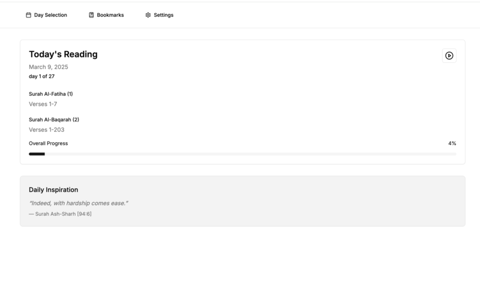
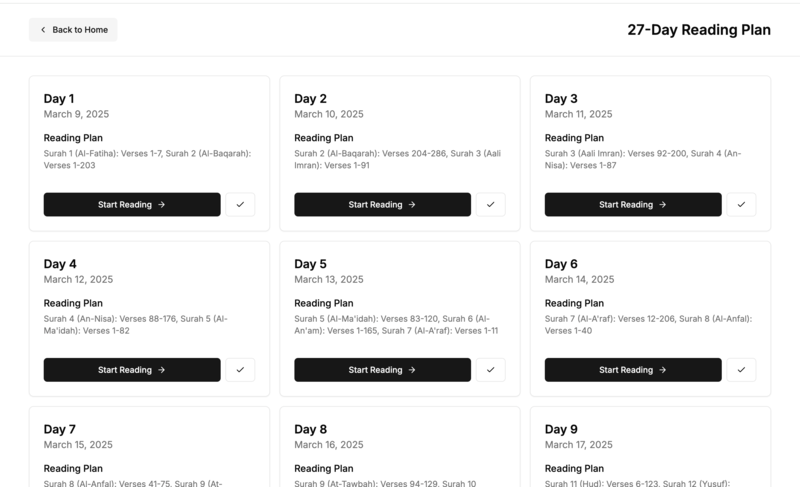
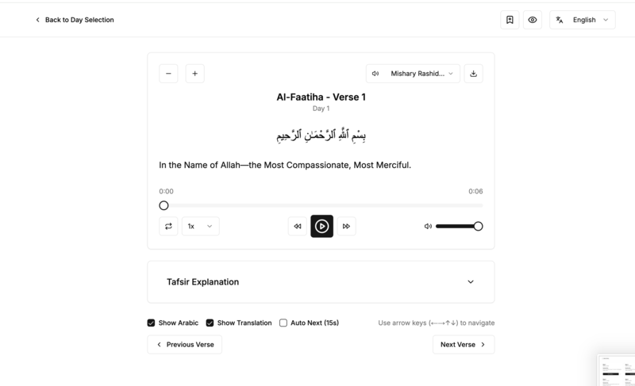

# Taraweeh Companion

A Progressive Web App (PWA) designed to help Muslims follow a structured 27-day Quran reading plan during Taraweeh prayers.

## 📖 About

Taraweeh Companion is an open-source web application that provides a guided approach to understanding the Quran during Taraweeh prayers. The app offers a carefully structured 27-day reading plan with translations, explanations, and Tafsir.


## 📸 Screenshots






### Key Features

- 📱 27-day structured Quran reading plan
- 🎯 Daily verse recommendations with translations
- 🔖 Bookmark verses for later reference
- 🌙 Dark mode support
- 🌐 Multiple language support (English, Urdu, Bengali)
- 📊 Progress tracking and reading journey
- ♿ Comprehensive accessibility features:
  - Font size adjustment
  - Line height customization
  - Letter spacing control
  - High contrast mode
  - Reduced motion
  - OpenDyslexic font support

## 🚀 Tech Stack

- **Framework**: Next.js
- **Styling**: Tailwind CSS
- **UI Components**: Radix UI
- **State Management**: Zustand
- **Data Fetching**: TanStack Query
- **Internationalization**: Built-in language system
- **PWA Support**: Next PWA

## 🛠️ Installation

```bash
# Clone the repository
git clone https://github.com/nadimtuhin/taraweeh-companion.git

# Navigate to the project directory
cd taraweeh-companion

# Install dependencies
npm install

# Start the development server
npm run dev
```

## 🧪 Testing

```bash
# Run tests
npm test
```

## 🤝 Contributing

Contributions are welcome! Please feel free to submit a Pull Request.

1. Fork the project
2. Create your feature branch (`git checkout -b feature/amazing-feature`)
3. Commit your changes (`git commit -m 'Add some amazing feature'`)
4. Push to the branch (`git push origin feature/amazing-feature`)
5. Open a Pull Request


## 📜 License

This project is licensed under the MIT License - see the [LICENSE](LICENSE) file for details.

## 👨‍💻 Developer

Built with ❤️ by [Nadim Tuhin](https://github.com/nadimtuhin) 